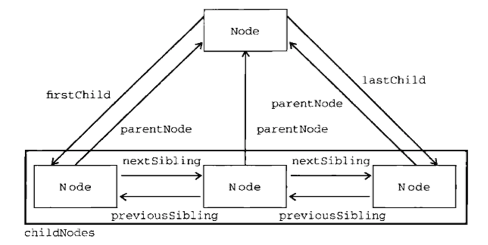

# DOM
> 理解包含不同层次节点的DOM；使用不同的节点类型；克服浏览器兼容性问题及各种陷进

DOM（文档对象模型），描绘了一个层次化的节点树，允许开发人员添加，移除和修改页面的某一部分。
本章节主要讨论与浏览器中HTML页面相关的`DOM1级`的特性和应用，以及JavaScript对DOM1级的实现。

## 一、节点层次
节点分为几种不同的类型，每种类型分别表示文档中不同的信息及（或）标记。
每个节点都拥有各自的特点，数据和方法，另外也与其他节点存在某种关系。
```html
<!DOCTYPE html>
<html>
<head>
    <title>Sample Page</title>
</head>
<body>
    <p>Hello World</p>
</body>
</html>
```
文档节点是每个文档的根节点。在上面这个例子中，文档节点只有一个子节点即`<html>`元素，我们称之为`文档元素`。文档元素是最外层的元素，文档中的其他元素都包含在这个元素中。每个文档只能有一个文档元素。
在HTML页面中，文档元素始终都是`<html>`元素
```html
Document
----Element html
--------Element head
------------Element title
----------------Text Sample Page
--------Element body
------------Element p
----------------Text Hello World
```

### 1.Node类型
DOM1级定义了一个Node接口，该接口由DOM中所有节点类型实现。这个Node接口在JavaScript中是作为Node类型实现的。
每个节点都有一个`nodeType`属性，用于表面该节点的类型，由12个数值常量表示，任何节点类型必定是其一。
```javascript
Node.ELEMENT_NODE (1);
Node.ATTRIBUTE_NODE(2);
Node.TEXT_NODE(3);
Node.CDATA_SECTION_NODE(4);
Node.ENTITY_REFERENCE_NODE(5);
Node.ENTITY_NODE(6);
Node.PROCESSING_INSTRUCTION_NODE(7);
Node.COMMENT_NODE(8);
Node.DOCUMENT_NODE(9);
Node.DOCUMENT_TYPE_NODE(10);
Node.DOCUMENT_PRAGMENT_NODE(11);
Node.NOTATION_NODE(12);
```
确定一个节点类型：
```javascript
if(someNode.nodeType == Node.ELEMENT_NODE){//IE中无效
    alert("Node is an element.");
}
//为了确保跨浏览兼容，最好将nodeType属性与数值比较
if(someNode.nodeType == 1){//适用于所有浏览器
    alert("Node is an element.");
}
```

明确节点之间的关系能够对我们查找和访问文档结构中的节点提供很大遍历。下图给出了节点之间的关系：


操作节点，DOM提供了一些操作节点的方法：
```javascript
appendChild();//1个参数，要插入的节点。最常用，返回新增的节点
insertBefore();//2个参数，要插入的节点和参照节点，参照节点如果为null则和上面一样
replaceChild();//2个参数，要插入的节点和要替换的节点，返回被替换的节点
removeChild();//1个参数，要移除的节点，返回被移除的节点
//其他方法
cloneNode();//创建节点的一个完全相同的副本，接收布尔值参数
normalize();
```

### 2.Document类型
//TODO

### 3.Element类型
//TODO

### 4.Text类型
//TODO

### 5.Comment类型,CDATASection类型,DocumentType类型,DocumentFragment类型,Attr类型
//TODO

## 二、DOM操作技术


