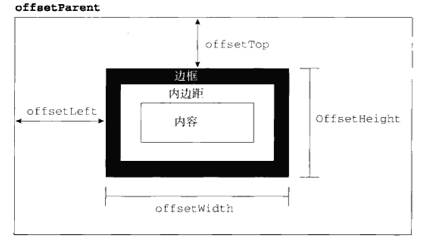
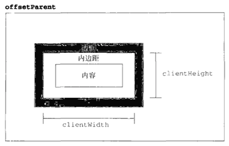
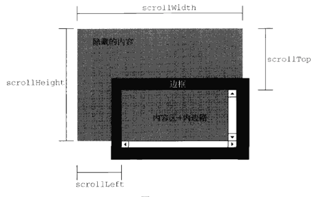

# DOM2和DOM3
DOM1级主要定义的是HTML和XML文档的底层结构。DOM2和DOM3则在这个基础上引入了更多的交互能力，也支持了更高级的XML特性。为此DOM2和DOM3级分为许多模块（模块之间有某种关联），分别描述了DOM某个非常具体的子集。这些模块如下：
- DOM2级核心：在1级基础上构建，为节点添加了更多的方法和属性。
- DOM2级视图：为文档定义了基于样式信息的不同视图。
- DOM2级事件：说明了如何使用事件与DOM文档交互。
- DOM2级样式：定义了如何以编程方式来访问和改变CSS样式信息。
- DOM2级遍历和范围：引入了遍历DOM文档和选择器特定部分的新接口。
- DOM2级HTML：在1级HTML基础上构建，添加了更多属性，方法和新接口。

## 一、DOM变化
//TODO

## 二、样式
//TODO

### 3.元素的大小
DOM中没有规定如何确定页面中元素的大小。为此IE率先引入了一些特性，以便开发人员使用。目前所有的主要浏览器都已经支持这些特性。
#### （一）、偏移量
偏移量（offset dimension），包括元素在屏幕上占用的所有可见空间。元素的可见大小由其高度、宽度决定，包括所有的内边距、滚动条和边框大小（`注意`不包括外边距）。通过下面的4个属性可以取得元素的偏移量。
- offsetHeight：元素在垂直方向上占用空间的大小，以像素计。包括元素的高度、（可见的）水平滚动条的高度、上边框高度和下边框高度。
- offsetWidth：元素在水平方向上占用的空间大小，以像素计。包括元素的宽度、（可见的）垂直滚动条的宽度、左边框宽度和有边框宽度。
- offsetLeft：元素的左外边框至包含元素的左内边框之间的像素距离。
- offsetTop：元素的上外边框至包含元素的上内边框之间的像素距离。


要想知道某个元素在页面上的偏移量，将这个元素的offsetLeft和offsetTop与其offsetParent的相同属性相加，如此循环直至根元素，就可以得到一个基本准确的值。下面两个函数就可以用于分别取得元素左和上的偏移量。
```javascript
function getElementLeft(element){
    var actualLeft = element.offsetLeft;
    var current = element.offsetParent;
    while(current !== null){
        actualLeft += current.offsetLeft;
        current = current.offsetParent;
    }
    return actualLeft;
}
function getElementTop(element){
    var actualTop = element.offsetTop;
    var current = element.offsetParent;
    while(current !== null){
        actualTop += current.offsetTop;
        current = current.offsetParent;
    }
    return actualTop;
}
```
对于简单的CSS布局页面，这两个函数可以得到非常精确的结果。对于使用表格和内嵌框架的布局页面，由于不同浏览器实现这些元素的方式不同，因此得到的值就不太精确了。
> 所有这些偏移量属性都是只读的，而且每次访问它们都需要重新计算。因此尽量避免重复访问这些属性；如果需要重复使用其中的某些属性值，可以将它们保存在局部变量中，以提高性能。

#### （二）、客户区大小
元素的客户区大小（client dimension），指的是元素内容及其内边距所占据的空间大小。有关客户区大小的属性有两个clientWidth和clientHeight。其中clientWidth属性是元素内容区宽度加上左右内边距宽度；clientHeight属性是元素内容区高度加上上下内边距高度。

> 与偏移量相似，客户区大小也是只读的，也是每次访问都要重新计算。

#### （三）、滚动大小
滚动大小（scroll dimension），是指包含滚动内容的元素的大小。有些元素（如`<html>`元素），即使没有执行任何代码也能自动的添加滚动条；但另外一些元素，则需要通过CSS的overflow属性才能滚动。以下是4个与滚动大小有关的属性。
- scrollHeight：在没有滚动条的情况下，元素内容的总高度
- scrollWidth：在没有滚动条的情况下，元素内容的总宽度
- scrollLeft：被隐藏在内容区域左侧的像素数。通过设置这个属性可以改变元素的滚动位置。
- scrollTop：被隐藏在元素内容区域上方的像素数。通过设置这个属性可以改变元素的滚动位置。


#### （四）、确定元素的大小
浏览器为每个元素都提供了一个getBoundingClientRect()方法，返回一个矩形对象包含left，top，right，bottom


## 三、遍历
NodeIterator
TreeWalker
//TODO

## 四、范围
//TODO
